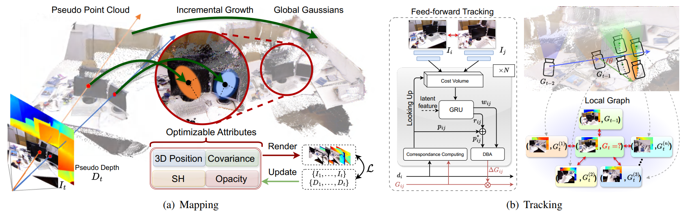

# Pseudo Depth Meets Gaussian: A Feed-forward RGB SLAM Baseline
### Paper(TODO)

> Pseudo Depth Meets Gaussian: A Feed-forward RGB SLAM Baseline  
> [Linqing Zhao](https://scholar.google.com/citations?user=ypxt5UEAAAAJ&hl=zh-CN&oi=ao)\*, [Xiuwei Xu](https://xuxw98.github.io/)\*, Yirui Wang, Hao Wang, [Wenzhao Zheng](https://wzzheng.net/), [Yansong Tang](https://andytang15.github.io/), [Haibin Yan](https://scholar.google.com/citations?user=-AQLKlsAAAAJ&hl=zh-CN)†, [Jiwen Lu](http://ivg.au.tsinghua.edu.cn/Jiwen_Lu/)

\* Equal contribution, † Corresponding author

DepthGS is a RGB-SLAM system that integrates monocular depth estimation, 3DGS scene representation and a neural network-based pose estimating module.

## News
- [2025/06/16] Paper accepted to IROS 2025 :confetti_ball:
- [2025/08/01] Code released :rocket:

## Method

Method pipeline:



## Getting Started

### Setup Environment

Our code has been developed with python 3.10, CUDA 11.7 and torch 1.13.1. It has been tested with python 3.10, CUDA 12.4 and torch 2.5.1, which also works.

1. Create environment & install necessary packages
```shell
conda create -n depthgs python=3.10
conda activate depthgs
conda install pytorch torchvision pytorch-cuda=12.4 -c pytorch -c nvidia
pip install -r requirements.txt
```

Then, install torch-scatter. Installing via pip may cause CUDA version incompatability (`.../torch_scatter/_version_cuda.so: undefined symbol`). In this case, download and install the appropriate version from [here](https://pytorch-geometric.com/whl/) (you shall navigate to find the correct python, torch and CUDA version). For example,

```shell
wget https://data.pyg.org/whl/torch-2.5.0%2Bcu124/torch_scatter-2.1.2%2Bpt25cu124-cp310-cp310-linux_x86_64.whl
pip install torch_scatter-2.1.2+pt25cu124-cp310-cp310-linux_x86_64.whl
```

2. Install 3DGS rasterization engine:
```shell
git clone git@github.com:JonathonLuiten/diff-gaussian-rasterization-w-depth.git
cd diff-gaussian-rasterization-w-depth
python setup.py install
pip install -e .
```

3. Install lietorch, pytorch-scatter and backends of DROID-SLAM:
```shell
git clone --recursive https://github.com/princeton-vl/DROID-SLAM.git
cd DROID-SLAM
# this will take a while
pip install thirdparty/lietorch
pip install thirdparty/pytorch_scatter
pip install -e .
```
Download [droid.pth](https://drive.google.com/file/d/1PpqVt1H4maBa_GbPJp4NwxRsd9jk-elh/view?usp=sharing) to `DROID-SLAM/droid.pth`.

4. Install monocular depth estimator e.g. UniDepthV2

### Prepare Dataset

Run your MDE model to get `(H, W)` depth maps, and save them as `.npy` files. Arrange data for each sequence as:
```
your_data_dir/seq0
├── intrinsics.txt
├── color
│   ├── 000000.png
│   ├── 000001.png
│   ├── ...
└── depth
    ├── 000000.npy
    ├── 000001.npy
    ├── ...
```

Where `intrinsics.txt` contains:
```
fx fy cx cy
```

Then, modify `SplaTAM/configs/custom/splatam.py` according to your data directory. (See `NOTE` in the script.)

### Run DepthGS system

```shell
python slam.py SplaTAM/configs/custom/splatam.py
```
Results will be saved to `experiments/custom/slam_run`. You can set the output directory by modifying `SplaTAM/configs/custom/splatam.py`.

Then, run
```shell
python SplaTAM/scripts/export_ply.py SplaTAM/configs/custom/splatam.py
```
to get `splat.ply`, which can be visualized with tools such as [SuperSplat](https://superspl.at/editor).

## Acknowledgement
We base our work on the great work [SplaTAM](https://github.com/spla-tam/SplaTAM). We also a lot for the excellent work [DROID-SLAM](https://github.com/princeton-vl/DROID-SLAM).

## Citation

If you find this project helpful, please consider citing the following paper:
```
# TODO
```
