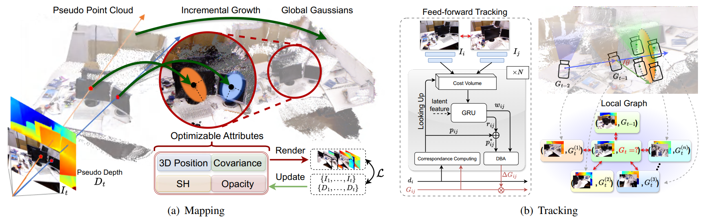

# Pseudo Depth Meets Gaussian: A Feed-forward RGB SLAM Baseline
### Paper(TODO) | Video(TODO)

> Pseudo Depth Meets Gaussian: A Feed-forward RGB SLAM Baseline
> [Linqing Zhao](https://scholar.google.com/citations?user=ypxt5UEAAAAJ&hl=zh-CN&oi=ao)\*, [Xiuwei Xu](https://xuxw98.github.io/)\*, Yirui Wang, Hao Wang, [Wenzhao Zheng](https://wzzheng.net/), [Yansong Tang](https://andytang15.github.io/), [Haibin Yan](https://scholar.google.com/citations?user=-AQLKlsAAAAJ&hl=zh-CN)†, [Jiwen Lu](http://ivg.au.tsinghua.edu.cn/Jiwen_Lu/)

\* Equal contribution, † Corresponding author

DepthGS is a RGB-SLAM system that integrates monocular depth estimation, 3DGS scene representation and a neural network-based pose estimating module.

## News
- [2025/6/16] Paper accepted to IROS 2025 :confetti_ball:

## Method

Method pipeline:

## TODO
code to be released!
